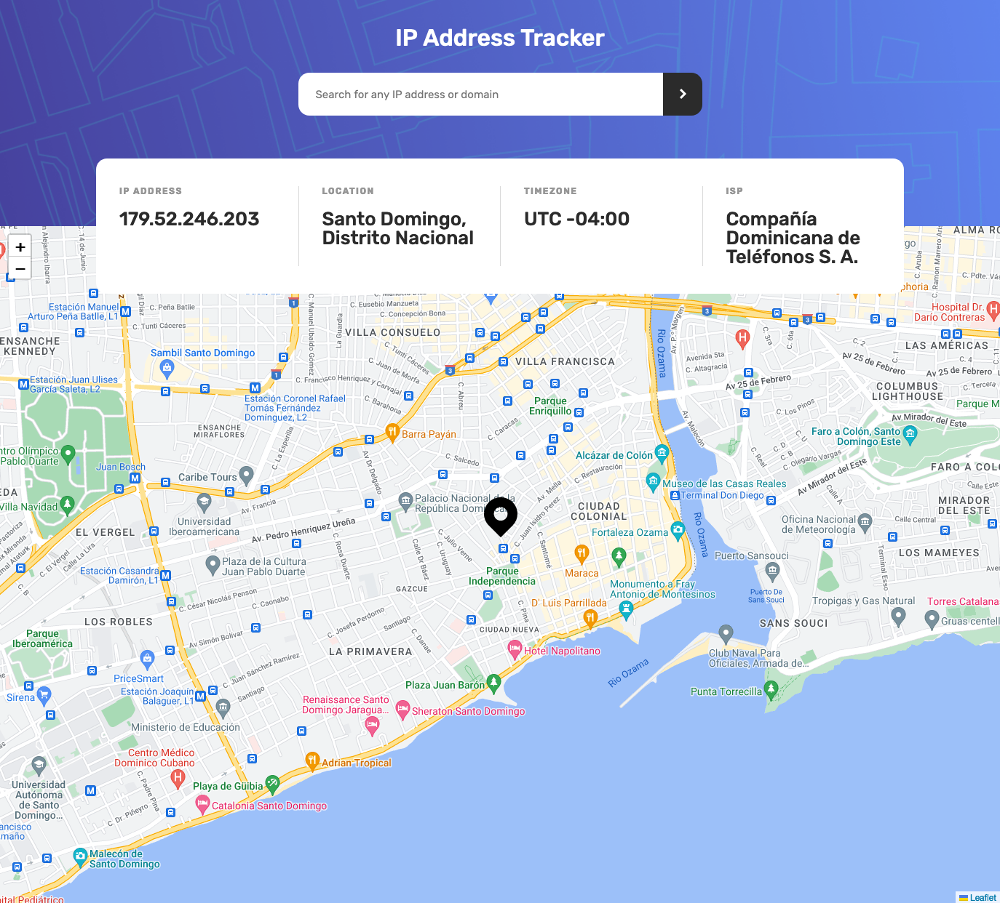
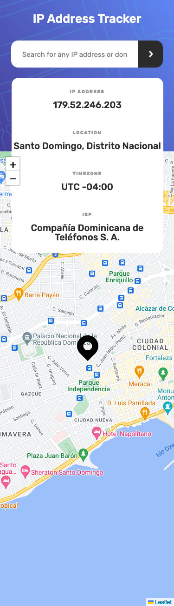

# Frontend Mentor - IP address tracker

## Table of contents

- [Overview](#overview)
  - [The challenge](#the-challenge)
  - [Screenshot](#screenshot)
  - [Links](#links)
- [My process](#my-process)

  - [Built with](#built-with)
  - [What I learned](#what-i-learned)

  - [Useful resources](#useful-resources)

- [Author](#author)

## Overview

### The challenge

Users should be able to:

- View the optimal layout for each page depending on their device's screen size
- See hover states for all interactive elements on the page
- See their own IP address on the map on the initial page load
- Search for any IP addresses and see the key information and location

### Screenshot

### Links

- Solution URL: [Repository](https://github.com/jeancarlosruiz/ip-address-tracker-main)
- Live Site URL: [Live Site](https://jeancarlosruiz.github.io/ip-address-tracker-main/)

## My process

### Built with

- Semantic HTML5 markup
- CSS custom properties
- Flexbox
- CSS Grid
- Mobile-first workflow

### What I learned

- Use API
- Fetch API
- Chaining Promises
- Promises
- How to consume promises with ASYNC/AWAIT

### Useful resources

- [Using Google Maps static tiles with Leaflet](https://gis.stackexchange.com/questions/225098/using-google-maps-static-tiles-with-leaflet)

## Author

- Website - [Jean Carlos Ruiz (Portfolio)](https://www.your-site.com) (Building website)
- Frontend Mentor - [@jeancarlosruiz](https://www.frontendmentor.io/profile/jeancarlosruiz)
